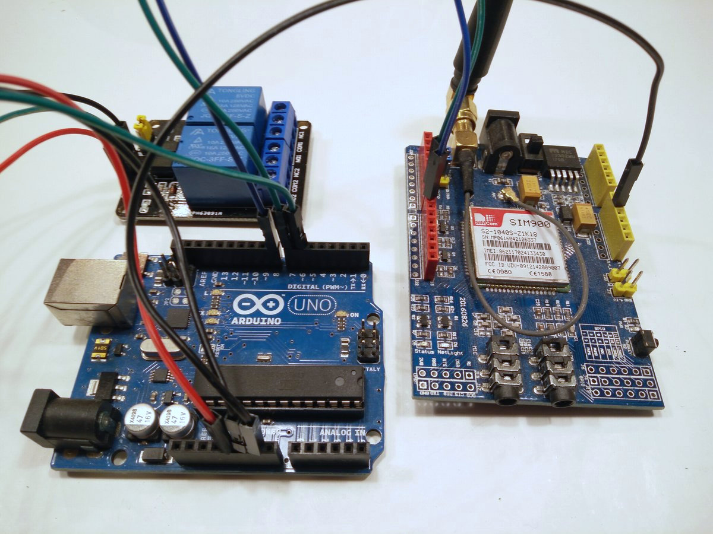
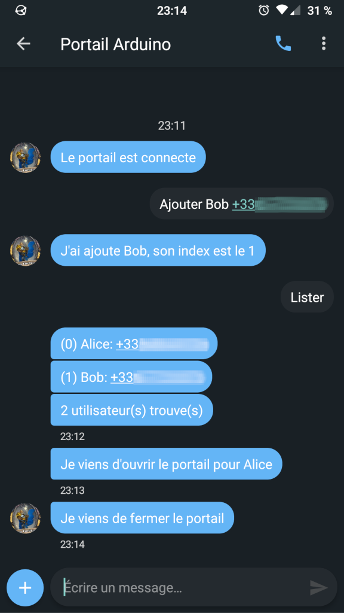
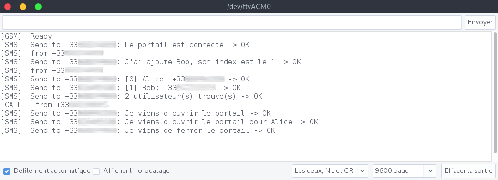

# Geoffrey

Geoffrey is an [Arduino](https://arduino.cc) based project to control your gate by calling a phone number.

Basically, I wanted to allow my family and friends to be able to open the gate at my house. I wanted something easy to use for them and for the price of a remote, here is Geoffrey ;)



## Details

You setup Geoffrey by giving your phone number, you'll then be the *admin* of the system.

Being the *admin*, you can configure the system with simple SMS to 
- Add a user to Geoffrey's whitelist
- Remove a user from Geoffrey's whitelist
- List users in the whitelist

How does Geoffrey work?
- When Geoffrey gets a call, he will open the gate if the caller is in his whitelist
- Once the gate is open, the caller will receive an SMS
- If Geoffrey has been called by a *user* and not the *admin*, then an SMS is also sent the the *admin*
- After one minute, Geoffrey will close the gate, and send an SMS to the *admin*

> Note: the behaviour (notifications, timeouts) can be configured

## Configuration using SMS

The admin can configure *users* by sending SMS:
- `Lister`: will display all the users
- `Ajouter ALIAS +33XXXXXXXXX`: will add a new user
- `Supprimer INDEX`: INDEX is the integer returned by the *Lister* command

> Note: the verbs *lister*, *ajouter* and *supprimer* can be translated like any message sent with SMS, see the *Translation* chapter

> Note: Action verbs are note case sensitive which is usefull with autocorrect ;)



# Hardware

## Arduino 

I used an Arduino UNO, but another model could be relevant as I don't use many I/O.

The number of users you can add depends on the *EEPROM* size. An Arduino Uno has 1KB, which allows 37 users.

## Sim 900 Shield

There is not so many choices to get GSM connectivity. I found the SIM900 Shield for less than 30€.

Here is a [very good tutorial for the SIM900 shield](https://lastminuteengineers.com/sim900-gsm-shield-arduino-tutorial/)

## Relay

I did not want to plug my system directly on the motors of my gate. The system should have been more complex, it should have been waterproof, would have required additionnal installation for power supply...

I chose to simple control a spare remote directly using a relay.
As the gate must be *opened* then *closed* and because some models have two different buttons for that two actions, I bought a 2 channels relay.

Here is another [very good tutorial to use a relay](https://lastminuteengineers.com/two-channel-relay-module-arduino-tutorial/)

> Note: In my case I only need one channel as the same button opens and closes the gate.

## Sim card

In France, we have cheap mobile plans thanks to [Free Mobile](http://mobile.free.fr/) and its 2€/month with unlimited SMS ;)

## Wirering

> Note: On the SIM900 Shield, use the two jumpers to choose *Software Serial*


# Software

## Arduino IDE

Download Arduino IDE, clone the project and its submodule.
I used to play with AT commands, few years ago and all I remember, *I should always use a library when possible!*

[Seeed Studio](https://github.com/Seeed-Studio/GPRS_SIM900) developped an Arduino library and it worked pretty well. I only got timeouts and errors when sending SMS, that is why I forked their lib.

By default, you can configure the system by sending SMS, but you can also use the serial port to send commands.

Some logs are also written on the serial port.




## Configuration

Before flashing your Arduino, you have to configure the firmware.
TO do that, change the values of the constants in the top of the file:

```c
#define PIN_NUMBER ""
#define ADMIN_NUMBER "+33XXXXXXXXX"
#define SMS_DISABLE false
#define SMS_NOTIFY_ADMIN true
#define SMS_NOTIFY_CALLER true
#define SERIAL_COMMANDS_ENABLE true
#define GATE_OPEN_DURATION 60000
```

- `PIN_NUMBER`: *Not used for now* because it is not supported by the SIM900 library for now
- `ADMIN_NUMBER`: set your phone number here. Only this number can add/remove users.
- `SMS_DISABLE`: to disable SMS feeback and use the serial terminal instead (for example to debug and not use too many SMS)
- `SMS_NOTIFY_ADMIN`: to notify the admin when a user opens the gate
- `SMS_NOTIFY_CALLER`: to notify the caller with an SMS when the gate is open after his call
- `SERIAL_COMMANDS_ENABLE`: to enable configration with the terminal in addition of SMS
- `GATE_OPEN_DURATION`: timeout after the gate is closed once open

## Translation

Geoffrey can be translated using constants:

```c
#define MSG_1 "Le portail est connecte"
#define MSG_2 "Je viens d'ouvrir le portail"
#define MSG_3 "Je viens d'ouvrir le portail pour %s"
#define MSG_4 "Je viens de fermer le portail"
#define MSG_5 "J'ai ajoute %s, son index est le %d"
#define MSG_6 "J'ai supprime l'utilisateur a l'index %d"
#define MSG_7 "[%d] %s: %s"
#define MSG_8 "%d utilisateur(s) trouve(s)"
#define ACTION_1 "lister"
#define ACTION_2 "ajouter "
#define ACTION_3 "supprimer "
```

You can translate either the send SMS messages but also the configuration verbs.

> Note: Respect the `%d` and `%s` orders in the SMS messages

> Note: Do not forget the extra *space* after `ACTION_2` and `ACTION_3`
